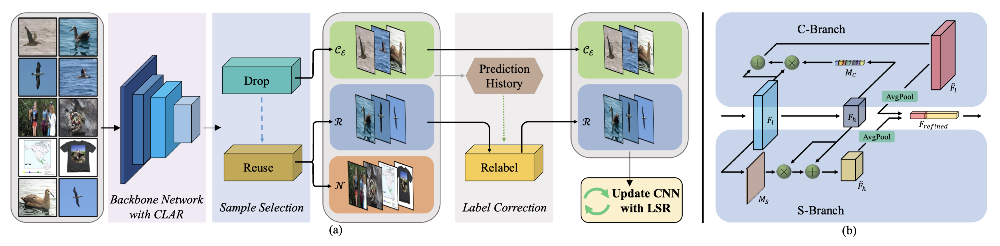

Introduction
---
Datasets and source code for our paper **Boosting Robust Learning via Leveraging Reusable Samples in Noisy Web Data**


Workflow
---



Installation
---
After creating a virtual environment of python 3.5, run `pip install -r requirements.txt` to install all dependencies

How to use
---
The code is currently tested only on GPU.
- Data Preparation

    Create a folder `Datasets` in the project root directory and download data into this folder using
    ```
    wget https://web-fgvc-496-5089-sh.oss-cn-shanghai.aliyuncs.com/web-aircraft.tar.gz
    tar -xvf web-aircraft.tar.gz
    
    # optional
    wget https://web-fgvc-496-5089-sh.oss-cn-shanghai.aliyuncs.com/web-bird.tar.gz
    wget https://web-fgvc-496-5089-sh.oss-cn-shanghai.aliyuncs.com/web-car.tar.gz
    tar -xvf web-bird.tar.gz
    tar -xvf web-car.tar.gz
    ```

- Source Code
  
    - If you want to train the whole model from beginning using the source code, please follow subsequent steps:
        - Prepare data
        - Modify `GPU` in the `train.sh`
        - Activate virtual environment (e.g. conda) and then run 
            ```
            bash train.sh
            ```

- Demo

    - If you just want to reproduce our result, please follow subsequent steps:
        - Prepare data
        - Download the following trained model
            ```
            wget https://fg-crssc-sh.oss-cn-shanghai.aliyuncs.com/aircraft.pth
            ```
        - Activate virtual environment (e.g. conda) and then run
            ```
            python demo.py --model_path aircraft.pth --dataset web-aircraft --nclasses 100 --gpu 4
            ```
